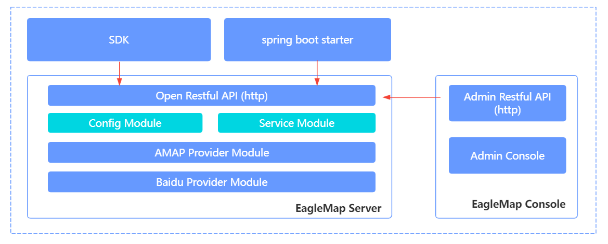

# 简介

## 概述

 

EagleMap是一个功能强大、简单易用、支持多地图服务商的中台服务系统，其设计目标是简化业务系统对于地图服务的使用。目前对接了国内主流的两大地图服务商：百度地图和高德地图，未来考虑将腾讯地图接入进来。

## 特性 

- EagleMap具有高扩展性的设计，可以方便的扩展对接三方地图服务商。
- 使用EagleMap后，业务系统可快速集成地图服务。
- 将多个地图厂商服务接口进行统一化，降低集成成本。
- 对于相同服务，EagleMap可以实现智能选择服务商进行提供服务。
- 对于地图服务商接口调用异常情况下进行重试机制处理。
- 对于轨迹类数据做了本地化存储，减少服务厂商的接口请求。
- 提供多终端集成的解决方案：Java SDK、Spring Boot starter、JS SDK。
- EagleMap提供了两种运行模式，分别是BASE、COMPLETE，业务系统可根据需求进行选择。
- EagleMap提供了可视化的管理系统进行管理。

## 版本发布历史

?> 1.0-SNAPSHOT  -> 发布于2022.3.26

## 下载

### 源码地址

| 项目                         | 源码仓库地址                                                 |
| ---------------------------- | ------------------------------------------------------------ |
| EagleMap                     |                                                              |
| EagleMap-sdk                 | https://gitee.com/itcastopen/EagleMap-sdk.git https://github.com/itcastopen/EagleMap-sdk.git |
| eaglemap-spring-boot-starter | https://gitee.com/itcastopen/eaglemap-spring-boot-starter.git https://github.com/itcastopen/eaglemap-spring-boot-starter.git |

### Maven依赖

~~~xml
<!--java sdk-->
<dependency>
    <groupId>com.itheima.em</groupId>
    <artifactId>EagleMap-sdk</artifactId>
    <version>{version}</version>
</dependency>

<!--springboot starter-->
<dependency>
    <groupId>com.itheima.em</groupId>
    <artifactId>eaglemap-spring-boot-starter</artifactId>
    <version>{version}</version>
</dependency>

<!-- 如果是SNAPSHOT版本，如要在项目的pom.xml文件中引入快照版源 -->
<repositories>
    <repository>
        <id>sonatypeSnapshots</id>
        <name>Sonatype Snapshots</name>
        <releases>
            <enabled>false</enabled>
        </releases>
        <snapshots>
            <enabled>true</enabled>
        </snapshots>
        <url>https://s01.oss.sonatype.org/content/repositories/snapshots/</url>
    </repository>
</repositories>
~~~

## 架构设计

### 设计思想

之所以会设计这样一个中台服务，是因为在企业项目中会有很多的场景用到地图服务，无论是使用百度地图还是高德地图都需要写各种的http请求、对数据的解析等代码，这样会在多个系统中出现相同的代码，而且一旦切换地图商，代码又得重新编写，为了能够让业务系统更加简单、快捷的集成地图服务，所以又必要使用一个中台化的地图服务。

### 系统组成

EagleMap是由两部分组成的，分别是server端和sdk端。

**server端：**

server端负责与地图服务商的对接，主要实现了两大功能：基础地图服务、轨迹服务，其中轨迹服务会将轨迹点等数据存储到MySQL中。对外通过restful提供接口服务，并且提供了可视化管理系统。

**sdk端：**

sdk端是通过http协议与server端进行通信，为了方便集成，sdk分为两种：java sdk与spring boot starter。

### 架构图

